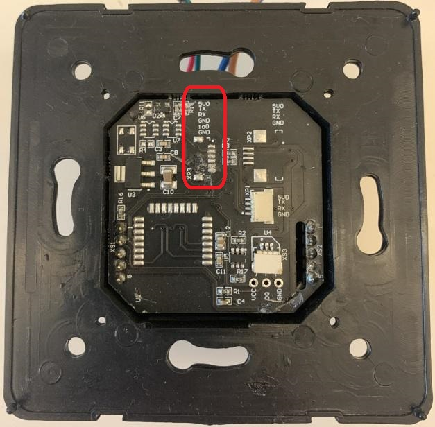

# Вводная информация

Термостат Lytko 101 построен на базе широко распространённых и
достаточно стандартных компонентов. В качестве процессора используется
ESP8266, к которому подключены реле, аналоговый датчик температуры (т.н.
NTC термистор. Такие же используются в большинстве, если не во всех
тёплых полах разных производителей, что позволяет поставить Lytko вместо
старого термостата) и экран Nextion. Факт использования ESP8266
открывает весьма лёгкий путь к замене оригинальной прошивки на
кастомную. В данной статье будем рассматривать замену оригинальной
прошивки на прошивку на основе ESPHome.

# Концепция ESPHome и ограничения

ESPHome в связке с HomeAssistant (HA) даёт возможность настроить систему
более гибко, особенно в плане подключения внешних датчиков. Например,
можно сконфигурировать датчик нагрева пола (термистор) с нестандартными
характеристиками. Или учитывать расход электричества, потреблённого
тёплым полом, получая текущее напряжение сети от умного счётчика,
подключённого к HA. Или подключить в качестве датчика температуры любой
другой температурный сенсор, уже подключённый к HA. Или даже
использовать несколько сенсоров и реализовать нужную логику агрегации
данных и работы. Или ... у вас наверняка найдутся ещё идеи.

ESPHome нацелен на создание кастомных прошивок и подразумевает их
компиляцию, поэтому многие вещи конфигурируются на этапе компиляции.
ESPHome ни в коем случае не претендует на полную замену стоковой
прошивки. Если вы не знаете, зачем вам нужна кастомная прошивка - то она
вам не нужна :). Термостат не будет работать надёжнее или экономнее (ну
разве что вы реализуете более умный алгоритм управления, учитывающий ваш
сценарий использования), внешний вид экрана не изменится. Также стоит
учитывать, что Lytko - это уже умный термостат и стоковая прошивка
позволяет подключить его к HA и другим системам автоматизации для задач
удалённого управления или создания расписания работы.

ESPHome прошивка настраивается в YAML файле. Это файл описания того, что
включено в прошивку, как оно конфигурируется и как взаимодействует. Все
основные элементы Lytko 101 поддержаны: реле управления нагрузкой,
датчик температуры пола, экран, управление по Wi-Fi, обновление по
воздуху. Из-за специфики ESPHome многие параметры настраиваются при
компиляции прошивки: настройки термистора, настройки пределов
регулировки температуры пола, настройка типа сервера домашней
автоматизации и даже данные для Wi-Fi подключения.

ESPHome версия использует оригинальную прошивку экрана, хотя замена
прошивки экрана на лету и поддержана в ESPHome. Основной экран и экран
блокировки функционируют максимально близко к фирменной прошивке от
Lytko. Поведение при первом старте сохранено лишь в части настройки
Wi-Fi. Меню настроек лишь отображает параметры работы, сконфигурированные
при компиляции, не позволяя изменять их, за исключением детской
блокировки. HomeKit совсем не поддерживается. Цифровой датчик
температуры не поддерживается (хотя добавить можно). По умолчанию
включён только HA протокол, он сам находит сервер в локальной сети,
поэтому включается универсально. Можно включить MQTT, но по идеологии
ESPHome адрес сервера указывается при компиляции.  
  
**Все нижеописанные манипуляции делаются на свой страх и риск!**

# Заливка готовой прошивки

Прошить термостат Lytko можно двумя способами. Через встроенный Web
интерфейс и через кабель. Прошивка через Web интерфейс проста и не
требует ничего дополнительного; прошивка через кабель требует
специальный переходник, возможно, пайку разъема, но позволит сделать
резервную копию оригинальной прошивки и настроек термостата.

Бинарные версии ESPHome прошивок для термостатов Lytko можно скачать
здесь:
[<u>https://github.com/anatoly-savchenkov/lytko-configs</u>](https://github.com/anatoly-savchenkov/lytko-configs).

При любом способе прошивки, настройки из оригинальной прошивки не
переносятся в альтернативную прошивку и будут утеряны, если не сохранены
через кабель.

## Рекомендуемый способ: прошивка через Web интерфейс

Прошивку можно выполнять как на этапе начальной настройки так и уже на
работающем устройстве. Если устройство ещё не настроено, переходим на
[<u>http://192.168.4.1/manual\_update</u>](http://192.168.4.1/manual_update).
Если термостат уже был настроен, то необходимо использовать
сконфигурированный IP адрес вместо указанного адреса по умолчанию. Когда
страница загрузится, выбираем файл с расширением bin, соответствующей
вашей модели термостата и прошиваем. Ждем пару минут и следуем
инструкции по [началу работы](#начало-работы).

## Запасной план: прошивка через кабель

Прошивка заливается через esptool. Для него потребуется python
([<u>https://www.python.org/downloads/windows/</u>](https://www.python.org/downloads/windows/)),
последний релиз отлично подойдёт. Под Windows Python лучше установить с
правами администратора, также как и пакеты, упомянутые в этой статье.
Тогда нужные утилиты автоматически попадут в PATH и не будет сложностей
с их вызовом по короткому имени. Esptool ставится через пакетный
менеджер python командой:
```
pip install esptool
```
Для прошивки потребуется USB to UART переходник. Я использую вот такой
[<u>https://aliexpress.ru/item/4000216010101.html</u>](https://aliexpress.ru/item/4000216010101.html).


Подключать UART нужно к 6-ти пиновому разъёму, см.
фото.



Нам нужны 4 контакта: 5V (он
же Vсс), TX, RX, GND. Эти же контакты вы найдёте на USB to UART
переходнике. Соединяем Vcc с 5V, GND с GND, TX с RX и RX c TX (да, тут
опечатки нет). Если будете использовать другой адаптер, то перепутанная
маркировка RX/TX – частое явление, попробуйте поменять местами, если не
заработает.

Важно не подключать термостат к сети 220В на этом этапе. Питание
подаётся с переходника и должно быть выставлено в 3.3В (игнорируем, что
на печатной плате Lytko написано 5V). Для подачи питания можно
использовать или контакты 6-ти пинового разъёма или любые иные имеющиеся
контактные площадки VCC и GND (а их ещё 3 на фото выше).

Для входа в режим UART flasher-а надо закоротить IO1 и GND контакты 6-ти
пинового разъёма и подать питание. Состояние контакта IO1 важно только в
момент включения.

Если вы всё любите контролировать, то факт перехода в режим UART flasher
можно отследить по тому, что пишет начальный загрузчик ESP8266 в UART
консоль (выводится на эти же пины). Для подключения к консоли нужно
сконфигурировать COM порт, соответствующий переходнику (вероятно, он
будет всего один в системе). Настройки: битрейт 74880, 8 бит, 1 стоп
бит, без контроля чётности. Хорошим выбором программы терминала будет
Putty
([<u>https://www.chiark.greenend.org.uk/~sgtatham/putty/</u>](https://www.chiark.greenend.org.uk/~sgtatham/putty/)).
Индикатором перехода в режим ожидания прошивки через UART будет строка
типа:
```
 ets Jan  8 2013,rst cause:1, boot mode:(1,3)
```
где важной является первая цифра в boot mode. Должна быть цифра 1. Если
первая цифра 3 – загрузка идёт из внутренней flash. Детали про загрузку
ESP можно почитать тут
[<u>https://docs.espressif.com/projects/esptool/en/latest/esp8266/advanced-topics/boot-mode-selection.html</u>](https://docs.espressif.com/projects/esptool/en/latest/esp8266/advanced-topics/boot-mode-selection.html)

Для revision 1.x платы термостата 6-ти пиновый разъем не распаян (как на
фото выше). Придётся найти и припаять разъем или хотя бы отдельные
провода. Можно паять не все шесть контактов, а только TX/RX, т.к. на
плате есть другие контакты GND и VCC, куда можно подать 3.3В от
USB-to-UART, а IO1 и GND можно закоротить плоской отвёрткой - они
соседние. Если паяльником совсем не владеете, можно пины прижать к
контактным площадкам. Если не с первого раза, то с десятого прошить
получится и так.

В UART flash mode мы вошли, прошивка распакована, esptool установлен -
можно начинать. Сначала рекомендуется сохранить оригинальную прошивку.
Её всегда можно будет вернуть прошив так же, как описано ниже.
```
esptool -b 460800 read_flash 0x0 0x400000 flash.out
```
Потом стереть содержимое всего флеша,
```
esptool erase_flash
```
а потом уже прошивать ESPHome версию
```
esptool -b 460800 write_flash 0x0 0x400000 firmware.bin
```
После каждого действия плату надо перезапускать и заново входить в режим
UART flasher. Или можно попробовать добавить опцию --after no\_reset. Но
после заливки прошивки сбросить питание всё равно придётся. И это будет
правильный момент, чтобы начать работать через встроенный блок питания
от сети 220В.

Важно: устройство может неполноценно работать, питаясь от USB to UART
переходника. Особенно не стоит делать попытки обновления по воздуху при
таком подключении. Это почти гарантированный способ повредить содержимое
flash памяти с необходимостью прошивать заново через кабель.

# Начало работы

Первый раз прошивка стартует в режиме Wi-Fi Access Point и показывает на
экране QR код для подключения к AP (как и стоковая прошивка). Сканируем
код телефоном, подключаемся к Wi-Fi. Если экрана нет, то просто мониторим
появление новой Wi-Fi сети с именем lytko101-hl-xxxxxx и подключаемся к
ней без пароля. Попадаем на портал настроек подключения к существующей
Wi-Fi сети, где нужно ввести SSID и пароль. Эти настройки сохранятся до
следующего обновления прошивки.

Если точка доступа не появилась в эфире даже через 5 минут после заливки
бинарной прошивки - попробуйте перезагрузить устройство по питанию.

Для интеграции в HA на сервере домашней автоматизации должна быть
проинсталлирована ESPHome intergration
([<u>https://www.home-assistant.io/integrations/esphome/</u>](https://www.home-assistant.io/integrations/esphome/)).
Убедитесь, что у вас установлена версия ESPHome не ниже чем 2022.9.0.
Когда интеграция установлена, HA увидит новое устройство автоматически
при подключении к сети, добавит его в панель управление, добавит
температурный сенсор, устройство управления климатом и ряд
вспомогательных сенсоров. YAML файл для Lytko 101 будет автоматически
подгружен с Github и добавлен в ESPHome интеграцию (пока не работает). Можно начинать
конфигурировать, добавлять новые штуки, компилировать и заливать
улучшенную версию по воздуху в термостат.

Также можно установить ESPHome локально на PC
([<u>https://esphome.io/guides/installing\_esphome.html</u>](https://esphome.io/guides/installing_esphome.html))
и иметь возможность собирать и настраивать прошивку локально и без HA.
YAML файл в этом случае нужно будет вручную скачать с Github
([<u>https://github.com/anatoly-savchenkov/lytko-configs</u>](https://github.com/anatoly-savchenkov/lytko-configs)),
выбрав YAML, соотвествующий вашей версии термостата.

Но даже если этого не сделать, устройство будет работать автономно,
полностью выполняя функции. Предсобранная бинарная версия ESPHome
прошивки настроена на следующие параметры:

-   Только HA интеграция

-   Имя точки доступа при первом включении или при отсутствии Wi-Fi
    подключения: Lytko101-xxxxxx (Lytko101-hl-xxxxxx для версии без
    экрана), без пароля

-   NTC датчик 10кОм при 25°C c бета коэффициентом в 3911

-   Диапазон регулирования целевой температуры 5-40°C, шаг 0.5°C, сдвиг
    показаний датчика температуры не задан

-   Целевая температура 27-29°C. Эти значения можно менять или через HA.
    Или кнопками на экране, но, в этом случае, с сохранением ранее
    заданного гистерезиса.

Примерно вот так выглядит Web интерфейс настройки термостата в случае ESPHome прошивки.


# Ограничение текущей версии

1.  Прошивка только для Lytko 101 и Lytko 101 без экрана. В Lytko 101+
    используется другой производитель экрана, который пока не
    поддерживается в ESPHome.

2.  Включена отладочная версия и она много пишет в лог, но на работу не
    влияет. Термостат имеет watchdog таймер, который сбрасывается по
    активности UART TX линии. Поэтому логирование сейчас сбрасывает
    таймер. Если собрать совсем без логирования, то таймер начнет
    перезагружать устройство.

3.  Сброс устройства через меню настроек выполняет лишь перезагрузку.
    Реальный сброс настроек появился в ESPHome 2022.09 (factory_reset),
    но ещё не добавлен в конфигурации.

4.  Используются пара исправлений ESPHome, ещё не включенных в релиз.
    Эти исправления будут автоматически использованы при
    самостоятельной переборке прошивки, всё описано в YAML.
